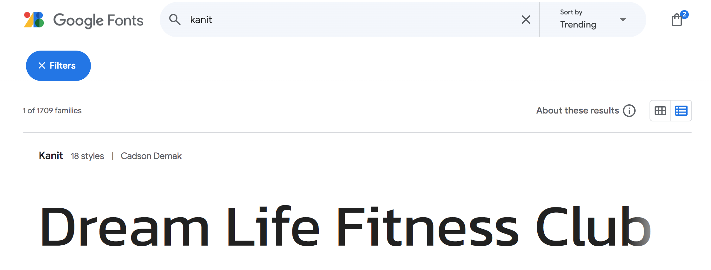
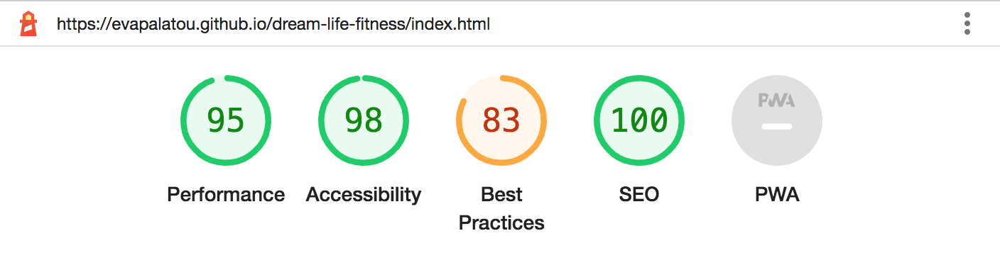

# Dream Life Fitness 

Dream Life Fitness Club is a website that heavily promotes personal training for a healthy lifestyle routine. DLFC is based on a four-core value system and is proud of its excellent location, workout sessions, a plethora of activities, and physical and mental health improvement. The website invites individuals to obtain a workout membership and hopes to help keep people motivated to meet up with its personal trainer for workout sessions regularly. The website will be targeted towards individuals or groups of people who are looking for a way to improve their well-being and keep themselves fit. Dream Life Fitness Club is useful for individuals of all ages, and allows them to seek information about a healthy lifestyle while encouraging physical exercise. The visitors of the website can contact the personal trainer directly, or enquire about a new membership with activities of their preference. 

The website can be accessed via the following <a href="https://evapalatou.github.io/dream-life-fitness/index.html" target="_blank">link</a>.

# Introduction
The purpose of this project is to create a user-friendly and effective platform that can manage large amounts of clients who are looking to get informed on personal training sessions and are seeking personalized exercise activities in the fitness club or outdoors. Additionally, the clients are requested to choose whether they wish to include nutrition consultation for the duration of the workout membership.

## User Stories
- As a **first-time visitor**, I would like to easily understand the main purpose of the website, so that I can learn more about the fitness club and the services that are offered. Furthermore, I would like to be able to navigate the website and access the content quickly. Finally, it is important to read any testimonials to see whether the fitness club is reliable and credible. 
- As a **returning visitor**, I would like to meet my personal trainer and be able to see his expertise and his professional experience. I would like to view more information about the workout activities that are taking place inside the fitness club and outdoors, in order to ask questions about availability, equipment, and pricelist. Finally, I want to be able to choose a full-blown personalized package that includes both workout and nutrition consultation. 
- As a **frequent visitor**, I would like to be able to keep in touch with my personal trainer about any changes to the class schedule and the exact location of the activities. Moreover, I would like to have the option to freely communicate with the fitness club about my progress or any new additions made to training packages. Last, but not least, it is important for me to follow any social media pages so that I am informed about any discounts, new activities, and contests that are currently running in the fitness club.  

# Features
### Navbar
- Navigation bar is positioned on the top of the page and contains the logo of the fitness club. 

- Burger menu is fully responsive on mobile devices.

### Footer
- The footer contains links to social media channels that open in a new window.

### Button
- The button acts like quick navigation link for the contact page.

### Flip Cards
- Hoverable flip cards with 3D effect provide contact information about the fitness club such as opening hours, address, phone number, contact e-mail. 

### Testimonials
- Flex Boxes testimonials section with reviews from our satisfied clients.

### Google Maps
- iframe google maps component with the exact location of the fitness club.

### Contact Form
- Instant message contact form inside the about page in order to contact the trainer in person.

### Image Gallery
- JavaScript gallery that includes images with all available activities. The controls of the gallery are designed for color blindness.

### Featured Products
- Featured products list section that hightlights fitness club's special activities.

### Membership Form
- User signup functionality to create a personalised membership via the website.

 

## Technologies
- HTML is used as the main structure of the website
- CSS is used to add the styles and layout of the website
- <a href="https://fontawesome.com/" target="_blank">Font Awesome</a> icons to make HTML code appear more descriptive
- <a href="https://marvelapp.com/" target="_blank">Marvel App</a> is used to make wireframes for the website
- JavaScript is used to develop the slideshow gallery within the website
- <a href="https://color.adobe.com/create/color-wheel" target="_blank">Adobe Color</a> palette generator for the user interface aesthetic feel

## Design
### Wireframes
- The wireframes created in Marvel App depict the final design and structure of the website

 

### Color Scheme
- The color palette of the website is based on the generic gradient color scheme. Dark and Lighter blue is used for the main content, whilst bright and soft orange for highlighting purposes (i.e. buttons, links, hover effect) 

 

### Typography
- The project utilizes the Kanit and Roboto font families for typography, providing a clean and modern aesthetic. The color scheme incorporates shades of white, dark blue, and orange, enhancing readability and visual appeal.

 

 

# Testing
## Browser Compatibility
- The website was tested on the following browsers: Chrome, Firefox, Opera

Chrome
 

Firefox
 

Opera
 

## Responsiveness
- The website was checked both by devtools implemented in Chrome browser and the Website Responsive Testing Tool (source: http://responsivetesttool.com/)

Chrome devtools
 

Website Responsive Testing Tool
 

## Code Validation
- No errors or warnings were found when passing through the official W3C validator (HTML and CSS)

Home Page

About Page

Gallery Page

Order Page

Contact Page

CSS jigsaw - one warning

## Features Testing

| Feature | Test case | Outcome |
| --- | --- | --- |
| Logo | Click on the logo | User is brought to the Home Page | 
| Navbar Home | Click on the "Home" link | The user is redirected to the main page | 
| Navbar About | Click on the "About" link | The user is redirected to the about page | 
| Navbar Gallery | Click on the "Gallery" link | The user is redirected to the gallery page | 
| Navbar Order | Click on the "Order" link | The user is redirected to the order page | 
| Navbar Contact | Click on the "Contact" link | The user is redirected to the contact page |
| Button Subscribe | Click on the "Subscribe" button | The user is redirected to the contact page | 
| Flip Cards | Hover over the first image | The user obtains class schedule information | 
| Flip Cards | Hover over the second image | The user views the address of the fitness club | 
| Flip Cards | Hover over the third image | The user views contact details |
| Google Maps | Click on Google maps iframe | The user uses scroll to zoom the map |
| Footer Facebook | Click on the Facebook icon | The user is redirected to the Facebook page |
| Footer Instagram | Click on the Instagram icon | The user is redirected to the Instagram page |
| Footer Linkedin | Click on the Linkedin icon | The user is redirected to the Linkedin page |
| Footer YouTube | Click on the YouTube icon | The user is redirected to the YouTube page |
| About form | Submit an empty form | Error signaling required fileds |
| About form | Submit a message form | The user is redirected to the Code Institute's dump form page |
| About form | Click on the Reset button | The user clears any text inputs |
| Gallery page | Click on the right control of the slideshow | The user is able to view more images |
| Order page | Click on the "Contact" button | The user is redirected to the contact page to signup the form | 
| Contact form | Submit an empty form | Error signaling required fileds |
| Contact form | Submit a membership form | The user is redirected to the Code Institute's dump form page |
| Contact form | Click on the Reset button | The user clears any text inputs |

## Lighthouse
- Using lighthouse in devtools, it is confirmed that the website is performing well and it is accessible. However, in most of the pages, the overall performance counts 80% which indicates that further improvements need to be made.

Home Page

About Page

Gallery Page

Order Page

Contact Page

## Accessibility
- Using WAVE tool, it is confirmed that the website has passed the accessibility test, as shown previously as well via the lighthouse reports.

## Bugs

1. Add bootstrap code to introductory text at the home page.
- Solution:
2. Resize the images at the flip cards section on the home page.
- Solution:
3. Add hover effect on social media icons at the footer section. [SOLVED]
- Solution: added the #social-networks i:hover in the .css file that changes the color of the icons
4. Create a thank you page for the message form at about page.
- Solution:
5. Center product cards container at the order page.
- Solution:
6. Remove JavaScript elements from the website, might cause poor overall performance.
- Solution:

# Deployment
### via Gitpod
1. Go to Your Cloud IDE, Gitpod
2. Click <a href="https://codeinstitute-ide.net/new" target="_blank">**New Workspace**</a>  
3. Select from dropdown menu the repository of this project <a href="https://github.com/evapalatou/dream-life-fitness" target="_blank">**Dream Life Fitness**</a>

### via Github 
1. In the GitHub repository, navigate to the **Settings** tab
2. From the Code and Automation dropdown menu select **Pages**
3. Select the branch to be **main** and the folder to be **/root** 
4. Then, click **save**
5. Follow the <a href="https://evapalatou.github.io/dream-life-fitness/" target="_blank">deployed link</a> to the website

# Future Improvements
- Add custom 404 error page
- Add fully functional message and membership forms
- Add a payment gateway for secure online transactions

# Credits
- <a href="https://fontawesome.com/" target="_blank">Font Awesome</a>: for the JavaScript icons used in the project
- <a href="https://www.pexels.com/" target="_blank">Pexels</a>: for the HD introductory video
- <a href="https://unsplash.com/" target="_blank">Unsplash</a>: for the images in the slideshow gallery
- <a href="https://www.w3schools.com/" target="_blank">W3schools</a>: for the features ideas at home page (e.g. timeline, flip cards)
- <a href="https://stackoverflow.com/" target="_blank">Stack Overflow</a>: for fixing bugs snippets
- <a href="https://blog.hubspot.com/" target="_blank">Hubspot Blog</a>: for helpful CSS tutorials
- <a href="https://www.joshwcomeau.com/" target="_blank">Joshw Comeau</a>: for useful CSS/HTML tutorials
- <a href="https://evapalatou.github.io/love-running/" target="_blank">Love Running</a>: for the initial idea
- <a href="https://learn.codeinstitute.net/ci_program/diplomainsoftwaredevelopmentecomm" target="_blank">Coders Coffeehouse</a>: for the contact information section

# Acknowledgements
- my mentor
- sotiris palatos
- Code Institute
- Kevin Powell

