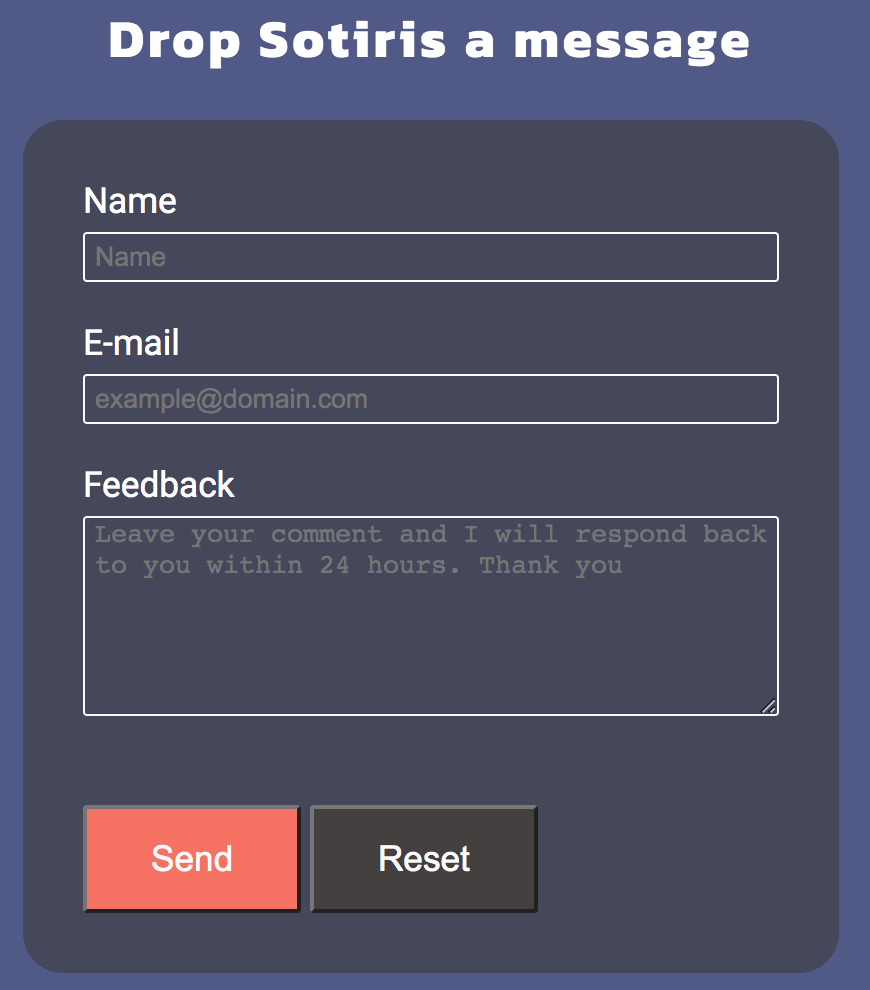
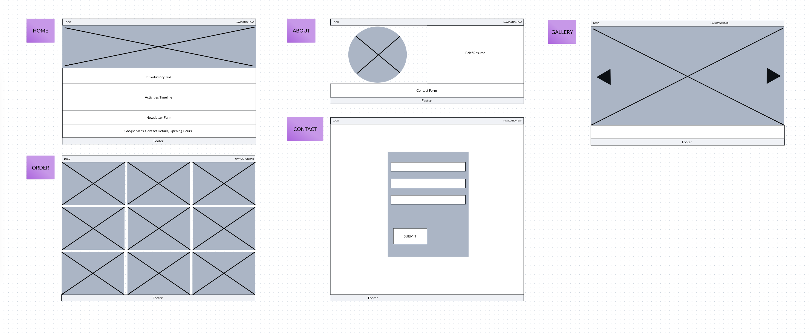
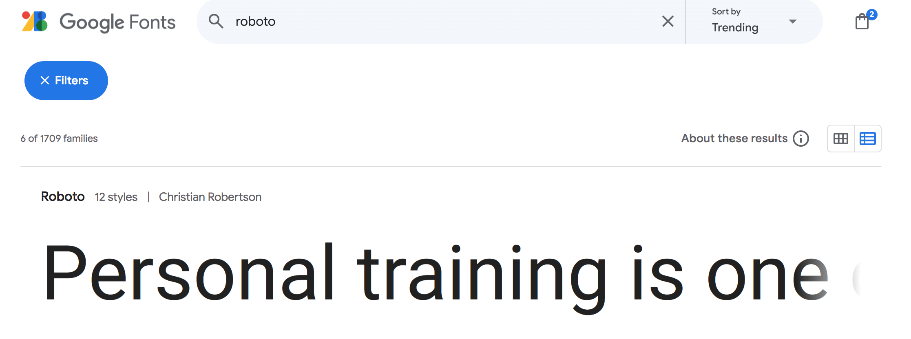

# Manual Testing

## Browsers
- The website was tested on the following browsers: Chrome, Firefox, Opera.

# Introduction
The purpose of this project is to create a user-friendly and effective platform that can manage large amounts of clients who are looking to get informed on personal training sessions and are seeking personalized exercise activities in the fitness club or outdoors. Additionally, the clients are requested to choose whether they wish to include nutrition consultation for the duration of the workout membership.

## User Stories
- As a **first-time visitor**, I would like to easily understand the main purpose of the website, so that I can learn more about the fitness club and the services that are offered. Furthermore, I would like to be able to navigate the website and access the content quickly. Finally, it is important to read any testimonials to see whether the fitness club is reliable and credible. 
- As a **returning visitor**, I would like to meet my personal trainer and be able to see his expertise and his professional experience. I would like to view more information about the workout activities that are taking place inside the fitness club and outdoors, in order to ask questions about availability, equipment, and pricelist. Finally, I want to be able to choose a full-blown personalized package that includes both workout and nutrition consultation. 
- As a **frequent visitor**, I would like to be able to keep in touch with my personal trainer about any changes to the class schedule and the exact location of the activities. Moreover, I would like to have the option to freely communicate with the fitness club about my progress or any new additions made to training packages. Last, but not least, it is important for me to follow any social media pages so that I am informed about any discounts, new activities, and contests that are currently running in the fitness club.  

# Features
### Navbar
- Navigation bar is positioned on the top of the page and contains the logo of the fitness club. 

- Burger menu is fully responsive on mobile devices.

### Footer
- The footer contains links to social media channels that open in a new window.

### Button
- The button acts like quick navigation link for the contact page.

### Flip Cards
- Hoverable flip cards with 3D effect provide contact information about the fitness club such as opening hours, address, phone number, contact e-mail. 

### Testimonials
- Flex Boxes testimonials section with reviews from our satisfied clients.

### Google Maps
- iframe google maps component with the exact location of the fitness club.

### Contact Form
- Instant message contact form inside the about page in order to contact the trainer in person.

### Image Gallery
- JavaScript gallery that includes images with all available activities. The controls of the gallery are designed for color blindness.

### Featured Products
- Featured products list section that hightlights fitness club's special activities.

### Membership Form
- User signup functionality to create a personalised membership via the website.

 

## Technologies
- HTML is used as the main structure of the website
- CSS is used to add the styles and layout of the website
- <a href="https://fontawesome.com/" target="_blank">Font Awesome</a> icons to make HTML code appear more descriptive
- <a href="https://marvelapp.com/" target="_blank">Marvel App</a> is used to make wireframes for the website
- JavaScript is used to develop the slideshow gallery within the website
- <a href="https://color.adobe.com/create/color-wheel" target="_blank">Adobe Color</a> palette generator for the user interface aesthetic feel

## Design
### Wireframes
- The wireframes created in Marvel App depict the final design and structure of the website

 

### Color Scheme
- The color palette of the website is based on the generic gradient color scheme. Dark and Lighter blue is used for the main content, whilst bright and soft orange for highlighting purposes (i.e. buttons, links, hover effect) 

 

### Typography
- The project utilizes the Kanit and Roboto font families for typography, providing a clean and modern aesthetic. The color scheme incorporates shades of white, dark blue, and orange, enhancing readability and visual appeal.

 

 

# Testing

# Deployment

# Future Improvements

# Credits

# Acknowledgements

